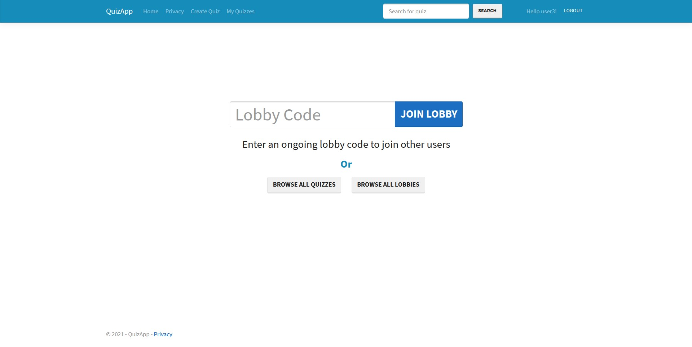

# QuizApp
# Work in progress
This is an application for managing quizzes. It allows users to take the same quiz together in real time.
## Table of contents
* [Features](#features)
* [Technologies](#technologies)
* [Application examplery usege](#application-examplery-useged)
* [To Do](#to-do)
## Features
* Create and manage your quizzes
* Browse all quizzes created by other users
* Create and join a lobby to take the same quiz with other users in real time
* Share a lobby code with other users to allow them to join your lobby
## Technologies
* ASP .NET Core 3.1.10
* Entity Framework
* Bootstrap
* JavaScript
* SignalR
### Additional Libraries
* SweetAlert2
* Summernote
* Fontawesome
### Database
Application uses MS SQL Server 2019
## To Do
* Take a quiz main page (question and answers)
* Quiz rating system
## Application exemplary usage
### Application home page

### Quiz creation page

### Quiz search result page

### Lobby page for host

### Lobby page for normal user

